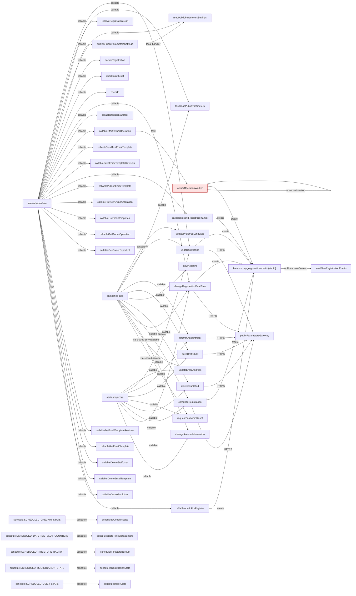

<!-- Generated by pnpm run functions:graph:update after source review. -->
# Function call map

Map of app-to-Cloud-Function calls, Firestore-triggered calls, calls between Cloud Functions (including local reuse of an exported handler), task dispatch, and scheduled entry points in this checkout. Helper chains that lead to another function or trigger are included. This is a source review, not a live cloud audit.

## Cycle findings

### Bounded owner backup polling

ownerOperationWorker still queues itself every 30 seconds while a yearly-reset backup is pending. The wait has a one-hour budget from the original createdAt, including queue delay. Checks run before the backup request, after its response, and before enqueueing or starting deletion. Expiry records failed / backup-timeout and acknowledges the task after lock cleanup; terminal redeliveries retry cleanup without restarting work. An external export can finish after this deadline. The purgeStartedAt marker is persisted before deletion, so partial purges resume under existing per-task retries without further backup polling. Locks are released in a transaction only when operationId matches. This is a bounded continuation cycle, not an acyclic graph. One hour is an operational policy, not a measured backup SLA; duplicate task deliveries mean it is not a strict dispatch-count limit.

Evidence: [santashop-functions/src/fn/ownerOperationWorker.ts:24](../santashop-functions/src/fn/ownerOperationWorker.ts#L24), [santashop-functions/src/fn/ownerOperationWorker.ts:126](../santashop-functions/src/fn/ownerOperationWorker.ts#L126), [santashop-functions/src/fn/ownerOperationWorker.ts:432](../santashop-functions/src/fn/ownerOperationWorker.ts#L432), [santashop-functions/src/fn/ownerOperationWorker.ts:499](../santashop-functions/src/fn/ownerOperationWorker.ts#L499), [santashop-functions/src/fn/ownerOperationWorker.ts:590](../santashop-functions/src/fn/ownerOperationWorker.ts#L590), [santashop-functions/src/fn/ownerOperationWorker.ts:99](../santashop-functions/src/fn/ownerOperationWorker.ts#L99).

## Runtime graph

Solid edges below represent calls, queue dispatch, or Firestore document creation. An upsert edge is a possible creation if the document is missing. Read/listen edges are not calls and are excluded.

## App and shared-service calls

These are callable construction sites and direct FunctionsWrapper method calls. Shared-core rows identify shared entry points; they do not assert that every shared method is used by both apps. The table includes emulator settings reads.

| Caller package | Function | Source |
| --- | --- | --- |
| santashop-admin | callableAdminPreRegister | [santashop-admin/src/app/pages/admin/pre-registration/pre-registration.page.ts:101](../santashop-admin/src/app/pages/admin/pre-registration/pre-registration.page.ts#L101) |
| santashop-admin | callableCreateStaffUser | [santashop-admin/src/app/pages/admin/users/staff.service.ts:65](../santashop-admin/src/app/pages/admin/users/staff.service.ts#L65) |
| santashop-admin | callableDeleteEmailTemplate | [santashop-admin/src/app/pages/admin/tools/email-templates/email-template.service.ts:77](../santashop-admin/src/app/pages/admin/tools/email-templates/email-template.service.ts#L77) |
| santashop-admin | callableDeleteStaffUser | [santashop-admin/src/app/pages/admin/users/staff.service.ts:81](../santashop-admin/src/app/pages/admin/users/staff.service.ts#L81) |
| santashop-admin | callableGetEmailTemplate | [santashop-admin/src/app/pages/admin/tools/email-templates/email-template.service.ts:35](../santashop-admin/src/app/pages/admin/tools/email-templates/email-template.service.ts#L35) |
| santashop-admin | callableGetEmailTemplateRevision | [santashop-admin/src/app/pages/admin/tools/email-templates/email-template.service.ts:46](../santashop-admin/src/app/pages/admin/tools/email-templates/email-template.service.ts#L46) |
| santashop-admin | callableGetOwnerExportUrl | [santashop-admin/src/app/pages/admin/tools/owner-operations/owner-operations.service.ts:55](../santashop-admin/src/app/pages/admin/tools/owner-operations/owner-operations.service.ts#L55) |
| santashop-admin | callableGetOwnerOperation | [santashop-admin/src/app/pages/admin/tools/owner-operations/owner-operations.service.ts:44](../santashop-admin/src/app/pages/admin/tools/owner-operations/owner-operations.service.ts#L44) |
| santashop-admin | callableListEmailTemplates | [santashop-admin/src/app/pages/admin/tools/email-templates/email-template.service.ts:25](../santashop-admin/src/app/pages/admin/tools/email-templates/email-template.service.ts#L25) |
| santashop-admin | callablePreviewOwnerOperation | [santashop-admin/src/app/pages/admin/tools/owner-operations/owner-operations.service.ts:24](../santashop-admin/src/app/pages/admin/tools/owner-operations/owner-operations.service.ts#L24) |
| santashop-admin | callablePublishEmailTemplate | [santashop-admin/src/app/pages/admin/tools/email-templates/email-template.service.ts:68](../santashop-admin/src/app/pages/admin/tools/email-templates/email-template.service.ts#L68) |
| santashop-admin | callableResendRegistrationEmail | [santashop-admin/src/app/pages/admin/tools/resend-email/resend-email.page.ts:67](../santashop-admin/src/app/pages/admin/tools/resend-email/resend-email.page.ts#L67) |
| santashop-admin | callableSaveEmailTemplateRevision | [santashop-admin/src/app/pages/admin/tools/email-templates/email-template.service.ts:57](../santashop-admin/src/app/pages/admin/tools/email-templates/email-template.service.ts#L57) |
| santashop-admin | callableSendTestEmailTemplate | [santashop-admin/src/app/pages/admin/tools/email-templates/email-template.service.ts:86](../santashop-admin/src/app/pages/admin/tools/email-templates/email-template.service.ts#L86) |
| santashop-admin | callableStartOwnerOperation | [santashop-admin/src/app/pages/admin/tools/owner-operations/owner-operations.service.ts:35](../santashop-admin/src/app/pages/admin/tools/owner-operations/owner-operations.service.ts#L35) |
| santashop-admin | callableUpdateStaffUser | [santashop-admin/src/app/pages/admin/users/staff.service.ts:74](../santashop-admin/src/app/pages/admin/users/staff.service.ts#L74) |
| santashop-admin | changeRegistrationDateTime | [santashop-admin/src/app/pages/admin/checkin/review/review.page.ts:128](../santashop-admin/src/app/pages/admin/checkin/review/review.page.ts#L128) |
| santashop-admin | checkIn | [santashop-admin/src/app/shared/services/check-in.service.ts:21](../santashop-admin/src/app/shared/services/check-in.service.ts#L21) |
| santashop-admin | checkInWithEdit | [santashop-admin/src/app/shared/services/check-in.service.ts:28](../santashop-admin/src/app/shared/services/check-in.service.ts#L28) |
| santashop-admin | onSiteRegistration | [santashop-admin/src/app/shared/services/check-in.service.ts:35](../santashop-admin/src/app/shared/services/check-in.service.ts#L35) |
| santashop-admin | publishPublicParametersSettings | [santashop-admin/src/app/shared/services/app-settings.service.ts:23](../santashop-admin/src/app/shared/services/app-settings.service.ts#L23) |
| santashop-admin | readPublicParametersSettings | [santashop-admin/src/app/shared/services/app-settings.service.ts:13](../santashop-admin/src/app/shared/services/app-settings.service.ts#L13) |
| santashop-admin | resolveRegistrationScan | [santashop-admin/src/app/shared/services/registration-scan.service.ts:48](../santashop-admin/src/app/shared/services/registration-scan.service.ts#L48) |
| santashop-admin | testReadPublicParameters | [santashop-admin/src/bootstrap-admin.ts:196](../santashop-admin/src/bootstrap-admin.ts#L196) |
| santashop-admin | undoRegistration | [santashop-admin/src/app/pages/admin/checkin/review/review.page.ts:113](../santashop-admin/src/app/pages/admin/checkin/review/review.page.ts#L113) |
| santashop-app | changeAccountInformation | [santashop-app/src/app/features/pre-registration/profile/profile.page.service.ts:100](../santashop-app/src/app/features/pre-registration/profile/profile.page.service.ts#L100) |
| santashop-app | changeRegistrationDateTime | [santashop-app/src/app/core/services/pre-registration.service.ts:195](../santashop-app/src/app/core/services/pre-registration.service.ts#L195) |
| santashop-app | completeRegistration | [santashop-app/src/app/core/services/pre-registration.service.ts:180](../santashop-app/src/app/core/services/pre-registration.service.ts#L180) |
| santashop-app | deleteDraftChild | [santashop-app/src/app/core/services/pre-registration.service.ts:167](../santashop-app/src/app/core/services/pre-registration.service.ts#L167) |
| santashop-app | newAccount | [santashop-app/src/app/features/sign-up/sign-up.page.service.ts:140](../santashop-app/src/app/features/sign-up/sign-up.page.service.ts#L140) |
| santashop-app | saveDraftChild | [santashop-app/src/app/core/services/pre-registration.service.ts:151](../santashop-app/src/app/core/services/pre-registration.service.ts#L151) |
| santashop-app | setDraftAppointment | [santashop-app/src/app/core/services/pre-registration.service.ts:174](../santashop-app/src/app/core/services/pre-registration.service.ts#L174) |
| santashop-app | testReadPublicParameters | [santashop-app/src/bootstrap.ts:150](../santashop-app/src/bootstrap.ts#L150) |
| santashop-app | undoRegistration | [santashop-app/src/app/core/services/pre-registration.service.ts:184](../santashop-app/src/app/core/services/pre-registration.service.ts#L184) |
| santashop-app | updatePreferredLanguage | [santashop-app/src/app/core/services/customer-language.service.ts:109](../santashop-app/src/app/core/services/customer-language.service.ts#L109) |
| santashop-core | changeAccountInformation | [santashop-core/src/lib/services/_functions-wrapper.ts:49](../santashop-core/src/lib/services/_functions-wrapper.ts#L49) |
| santashop-core | changeRegistrationDateTime | [santashop-core/src/lib/services/_functions-wrapper.ts:66](../santashop-core/src/lib/services/_functions-wrapper.ts#L66) |
| santashop-core | completeRegistration | [santashop-core/src/lib/services/_functions-wrapper.ts:95](../santashop-core/src/lib/services/_functions-wrapper.ts#L95) |
| santashop-core | deleteDraftChild | [santashop-core/src/lib/services/_functions-wrapper.ts:84](../santashop-core/src/lib/services/_functions-wrapper.ts#L84) |
| santashop-core | requestPasswordReset | [santashop-core/src/lib/services/_functions-wrapper.ts:41](../santashop-core/src/lib/services/_functions-wrapper.ts#L41) |
| santashop-core | requestPasswordReset | [santashop-core/src/lib/services/auth.service.ts:187](../santashop-core/src/lib/services/auth.service.ts#L187) |
| santashop-core | saveDraftChild | [santashop-core/src/lib/services/_functions-wrapper.ts:78](../santashop-core/src/lib/services/_functions-wrapper.ts#L78) |
| santashop-core | setDraftAppointment | [santashop-core/src/lib/services/_functions-wrapper.ts:90](../santashop-core/src/lib/services/_functions-wrapper.ts#L90) |
| santashop-core | undoRegistration | [santashop-core/src/lib/services/_functions-wrapper.ts:57](../santashop-core/src/lib/services/_functions-wrapper.ts#L57) |
| santashop-core | updateEmailAddress | [santashop-core/src/lib/services/_functions-wrapper.ts:32](../santashop-core/src/lib/services/_functions-wrapper.ts#L32) |
| santashop-core | updateEmailAddress | [santashop-core/src/lib/services/auth.service.ts:245](../santashop-core/src/lib/services/auth.service.ts#L245) |

### App paths through shared AuthService

| App | Function | Local helper chain | Evidence |
| --- | --- | --- | --- |
| santashop-app | requestPasswordReset | AuthService.resetPassword -> FunctionsWrapper.requestPasswordReset | [santashop-app/src/app/home/home.page.ts:136](../santashop-app/src/app/home/home.page.ts#L136) [santashop-core/src/lib/services/auth.service.ts:187](../santashop-core/src/lib/services/auth.service.ts#L187) |
| santashop-app | updateEmailAddress | AuthService.changeEmailAddress -> FunctionsWrapper.updateEmailAddress | [santashop-app/src/app/features/pre-registration/profile/profile.page.service.ts:121](../santashop-app/src/app/features/pre-registration/profile/profile.page.service.ts#L121) [santashop-app/src/app/features/pre-registration/overview/overview.page.ts:269](../santashop-app/src/app/features/pre-registration/overview/overview.page.ts#L269) [santashop-core/src/lib/services/auth.service.ts:245](../santashop-core/src/lib/services/auth.service.ts#L245) |

## Function, Firestore, and task edges

| From | To | Kind / condition | Evidence |
| --- | --- | --- | --- |
| completeRegistration | publicParametersGateway | HTTPS: getPublicParameters -> cached refresh -> authenticated private gateway; deployed environments only | [santashop-functions/src/fn/completeRegistration.ts:45](../santashop-functions/src/fn/completeRegistration.ts#L45) [santashop-functions/src/utility/public-parameters.ts:110](../santashop-functions/src/utility/public-parameters.ts#L110) |
| undoRegistration | publicParametersGateway | HTTPS: getPublicParameters -> cached refresh -> authenticated private gateway; deployed environments only | [santashop-functions/src/fn/undoRegistration.ts:65](../santashop-functions/src/fn/undoRegistration.ts#L65) [santashop-functions/src/utility/public-parameters.ts:110](../santashop-functions/src/utility/public-parameters.ts#L110) |
| setDraftAppointment | publicParametersGateway | HTTPS: getPublicParameters -> cached refresh -> authenticated private gateway; deployed environments only | [santashop-functions/src/fn/setDraftAppointment.ts:45](../santashop-functions/src/fn/setDraftAppointment.ts#L45) [santashop-functions/src/utility/public-parameters.ts:110](../santashop-functions/src/utility/public-parameters.ts#L110) |
| deleteDraftChild | publicParametersGateway | HTTPS: getPublicParameters -> cached refresh -> authenticated private gateway; deployed environments only | [santashop-functions/src/fn/deleteDraftChild.ts:42](../santashop-functions/src/fn/deleteDraftChild.ts#L42) [santashop-functions/src/utility/public-parameters.ts:110](../santashop-functions/src/utility/public-parameters.ts#L110) |
| saveDraftChild | publicParametersGateway | HTTPS: getPublicParameters -> cached refresh -> authenticated private gateway; deployed environments only | [santashop-functions/src/fn/saveDraftChild.ts:33](../santashop-functions/src/fn/saveDraftChild.ts#L33) [santashop-functions/src/utility/public-parameters.ts:110](../santashop-functions/src/utility/public-parameters.ts#L110) |
| changeRegistrationDateTime | publicParametersGateway | HTTPS: getPublicParameters -> cached refresh -> authenticated private gateway; deployed environments only | [santashop-functions/src/fn/changeRegistrationDateTime.ts:69](../santashop-functions/src/fn/changeRegistrationDateTime.ts#L69) [santashop-functions/src/utility/public-parameters.ts:110](../santashop-functions/src/utility/public-parameters.ts#L110) |
| completeRegistration | firestore:tmp_registrationemails/{docId} | create: New queue document for confirmation or resend | [santashop-functions/src/fn/completeRegistration.ts:182](../santashop-functions/src/fn/completeRegistration.ts#L182) |
| changeRegistrationDateTime | firestore:tmp_registrationemails/{docId} | create: New queue document for confirmation or resend | [santashop-functions/src/fn/changeRegistrationDateTime.ts:173](../santashop-functions/src/fn/changeRegistrationDateTime.ts#L173) |
| undoRegistration | firestore:tmp_registrationemails/{docId} | create: Cancellation email, when contact information is present | [santashop-functions/src/fn/undoRegistration.ts:172](../santashop-functions/src/fn/undoRegistration.ts#L172) |
| callableAdminPreRegister | firestore:tmp_registrationemails/{docId} | create: New queue document for confirmation or resend | [santashop-functions/src/fn/callableAdminPreRegister.ts:122](../santashop-functions/src/fn/callableAdminPreRegister.ts#L122) [santashop-functions/src/fn/callableAdminPreRegister.ts:161](../santashop-functions/src/fn/callableAdminPreRegister.ts#L161) |
| callableResendRegistrationEmail | firestore:tmp_registrationemails/{docId} | create: New queue document for confirmation or resend | [santashop-functions/src/fn/callableResendRegistrationEmail.ts:90](../santashop-functions/src/fn/callableResendRegistrationEmail.ts#L90) |
| callableStartOwnerOperation | ownerOperationWorker | task: Start an authorized owner operation; enqueue a Cloud Task | [santashop-functions/src/fn/ownerOperations.ts:626](../santashop-functions/src/fn/ownerOperations.ts#L626) |
| ownerOperationWorker | ownerOperationWorker | task-continuation: Yearly-reset backup polling only, within one hour of createdAt and before purgeStartedAt; next task delayed 30 seconds | [santashop-functions/src/fn/ownerOperationWorker.ts:91](../santashop-functions/src/fn/ownerOperationWorker.ts#L91) [santashop-functions/src/fn/ownerOperationWorker.ts:469](../santashop-functions/src/fn/ownerOperationWorker.ts#L469) [santashop-functions/src/fn/ownerOperationWorker.ts:488](../santashop-functions/src/fn/ownerOperationWorker.ts#L488) |
| ownerOperationWorker | firestore:tmp_registrationemails/{docId} | create: queue-reminder-emails -> local executeReminderQueue -> queueReminderEmails -> queueReminderEmailRecords | [santashop-functions/src/fn/ownerOperationWorker.ts:175](../santashop-functions/src/fn/ownerOperationWorker.ts#L175) [santashop-functions/src/fn/queueReminderEmails.ts:147](../santashop-functions/src/fn/queueReminderEmails.ts#L147) |
| publishPublicParametersSettings | readPublicParametersSettings | local-handler: Emulator branch calls the read handler implementation directly after writing _testConfig/publicParameters; no network invocation | [santashop-functions/src/fn/publicParametersSettings.ts:101](../santashop-functions/src/fn/publicParametersSettings.ts#L101) |
| firestore:tmp_registrationemails/{docId} | sendNewRegistrationEmails | onDocumentCreated | [santashop-functions/src/index.ts:452](../santashop-functions/src/index.ts#L452) |

## Scheduled calls

Cadence is supplied through required environment variables. Values below are repository configuration, not a live Cloud Scheduler inventory. All five use SHOP_TIME_ZONE / SANTASHOP_TIME_ZONE (America/Denver in the example and CI configuration).

| Function | Schedule variable | Example schedule | PR CI test schedule | Handler |
| --- | --- | --- | --- | --- |
| scheduledFirestoreBackup | SCHEDULED_FIRESTORE_BACKUP | `0 0 * 11,12 *` | `0 0 * 11,12 *` | [santashop-functions/src/fn/scheduledFirestoreBackup.ts](../santashop-functions/src/fn/scheduledFirestoreBackup.ts) |
| scheduledDateTimeSlotCounters | SCHEDULED_DATETIME_SLOT_COUNTERS | `*/5 * * 11,12 *` | `*/5 * * 11,12 *` | [santashop-functions/src/fn/reconcileAppointmentCounters.ts](../santashop-functions/src/fn/reconcileAppointmentCounters.ts) |
| scheduledRegistrationStats | SCHEDULED_REGISTRATION_STATS | `59 23 * * *` | `59 23 * * *` | [santashop-functions/src/fn/scheduledRegistrationStats.ts](../santashop-functions/src/fn/scheduledRegistrationStats.ts) |
| scheduledUserStats | SCHEDULED_USER_STATS | `55 23 * 11,12 *` | `55 23 * 11,12 *` | [santashop-functions/src/fn/scheduledUserStats.ts](../santashop-functions/src/fn/scheduledUserStats.ts) |
| scheduledCheckInStats | SCHEDULED_CHECKIN_STATS | `*/5 10,11,12,13,14,15,16 12,13,15,16 12 *` | `*/5 10,11,12,13,14,15,16 12,13,15,16 12 *` | [santashop-functions/src/fn/scheduledCheckInStats.ts](../santashop-functions/src/fn/scheduledCheckInStats.ts) |

The source has one Firestore trigger: onDocumentCreated on tmp_registrationemails/{docId}. There are no registration, user, check-in, dateTimeSlots, or stats Firestore triggers in index.ts. Writes to those collections do not, by themselves, invoke a function in this source graph. Changing this to an update/write trigger would make the email feedback path much broader.

scheduledDateTimeSlotCounters calls the local reconcileAppointmentCounters handler: it reads registrations/dateTimeSlots, updates slot counters, and writes stats/schedule-{year}. scheduledRegistrationStats reads submitted registrations and writes stats/registration-{year}. scheduledUserStats reads users and writes stats/user-{year}. scheduledCheckInStats reads pending checkins, marks processed records, and updates stats/checkin-{year}. scheduledFirestoreBackup starts a Firestore export to Cloud Storage. None calls another deployed function in the reviewed source.

Reminder email queueing is an owner task operation, not a sixth scheduler. The worker also calls local ownerOperations helpers (season guard and marketing-export check); these helpers do not enqueue work. Importing that module does not mean the worker calls startOwnerOperation.

The six registration/draft callables use the private publicParametersGateway through a cache refresh. The gateway reads Remote Config and calls parsing/deadline helpers; it does not call getPublicParameters or fetchPublicParametersFromGateway. The shared module imports do not establish a gateway self-call. Customer and admin Remote Config polling goes to the Firebase service, not this private Cloud Function.

The publicParametersSettings publish handler calls the read implementation only in the emulator branch. This is local function reuse, not a callable request. The complete inventory below also lists each exported function-to-handler-module path.

emailIsolationProbe is deployed only in explicit load-test mode. Its implementation and hash-only sink support live under scripts/load/functions. The three email senders check an independent Remote Config boolean through a local three-minute cache. Missing or expired-unavailable permission blocks sending. Queue suppression updates only existing records and remains terminal after re-enabling; it does not create a trigger edge. Auth, Storage, SES, Remote Config, and Firestore export APIs are external sinks in this function graph.

The email handler only updates existing queue records. Missing records stop processing; transaction.update cannot create a new record. After SES acceptance, provider logging and guarded registration status updates survive queue deletion without recreating it. Updating a queue record does not fire its creation trigger, so the former email recreation edge is absent.

Before deploying this marker-based timeout over an older revision, inspect active yearly resets. An older partially completed purge has no purgeStartedAt marker and cannot safely be classified using stage or completed progress alone. Do not deploy across an active legacy reset without resolving its state. Missing or malformed createdAt values fail without starting an export or extending the budget. Seasonal and backup prerequisites remain in force.

Emulator-only test handlers are QA entry points except testReadPublicParameters, which both app bootstraps use locally. Map generation and cycle checks never invoke handlers or modify cloud data.

## Complete exported function inventory

42 deployed-source functions and 15 emulator-only functions. A function with no outgoing edge still appears here. Handler modules are local implementation calls, not additional deployments.

| Function | Trigger | App callers | Handler module | Definition |
| --- | --- | --- | --- | --- |
| emailIsolationProbe | onRequest | No app call found | [scripts/load/functions/emailIsolationProbe.ts](../scripts/load/functions/emailIsolationProbe.ts) | [santashop-functions/src/index.ts:139](../santashop-functions/src/index.ts#L139) |
| publicParametersGateway | onRequest | No app call found | [santashop-functions/src/fn/publicParametersGateway.ts](../santashop-functions/src/fn/publicParametersGateway.ts) | [santashop-functions/src/index.ts:166](../santashop-functions/src/index.ts#L166) |
| changeAccountInformation | onCall | santashop-app, santashop-core | [santashop-functions/src/fn/changeAccountInformation.ts](../santashop-functions/src/fn/changeAccountInformation.ts) | [santashop-functions/src/index.ts:180](../santashop-functions/src/index.ts#L180) |
| completeRegistration | onCall | santashop-app, santashop-core | [santashop-functions/src/fn/completeRegistration.ts](../santashop-functions/src/fn/completeRegistration.ts) | [santashop-functions/src/index.ts:195](../santashop-functions/src/index.ts#L195) |
| saveDraftChild | onCall | santashop-app, santashop-core | [santashop-functions/src/fn/saveDraftChild.ts](../santashop-functions/src/fn/saveDraftChild.ts) | [santashop-functions/src/index.ts:202](../santashop-functions/src/index.ts#L202) |
| deleteDraftChild | onCall | santashop-app, santashop-core | [santashop-functions/src/fn/deleteDraftChild.ts](../santashop-functions/src/fn/deleteDraftChild.ts) | [santashop-functions/src/index.ts:209](../santashop-functions/src/index.ts#L209) |
| setDraftAppointment | onCall | santashop-app, santashop-core | [santashop-functions/src/fn/setDraftAppointment.ts](../santashop-functions/src/fn/setDraftAppointment.ts) | [santashop-functions/src/index.ts:216](../santashop-functions/src/index.ts#L216) |
| newAccount | onCall | santashop-app | [santashop-functions/src/fn/newAccount.ts](../santashop-functions/src/fn/newAccount.ts) | [santashop-functions/src/index.ts:223](../santashop-functions/src/index.ts#L223) |
| undoRegistration | onCall | santashop-admin, santashop-app, santashop-core | [santashop-functions/src/fn/undoRegistration.ts](../santashop-functions/src/fn/undoRegistration.ts) | [santashop-functions/src/index.ts:230](../santashop-functions/src/index.ts#L230) |
| changeRegistrationDateTime | onCall | santashop-admin, santashop-app, santashop-core | [santashop-functions/src/fn/changeRegistrationDateTime.ts](../santashop-functions/src/fn/changeRegistrationDateTime.ts) | [santashop-functions/src/index.ts:237](../santashop-functions/src/index.ts#L237) |
| updateEmailAddress | onCall | santashop-core | [santashop-functions/src/fn/updateEmailAddress.ts](../santashop-functions/src/fn/updateEmailAddress.ts) | [santashop-functions/src/index.ts:246](../santashop-functions/src/index.ts#L246) |
| checkIn | onCall | santashop-admin | [santashop-functions/src/fn/checkIn.ts](../santashop-functions/src/fn/checkIn.ts) | [santashop-functions/src/index.ts:253](../santashop-functions/src/index.ts#L253) |
| resolveRegistrationScan | onCall | santashop-admin | [santashop-functions/src/fn/resolveRegistrationScan.ts](../santashop-functions/src/fn/resolveRegistrationScan.ts) | [santashop-functions/src/index.ts:260](../santashop-functions/src/index.ts#L260) |
| checkInWithEdit | onCall | santashop-admin | [santashop-functions/src/fn/checkInWithEdit.ts](../santashop-functions/src/fn/checkInWithEdit.ts) | [santashop-functions/src/index.ts:267](../santashop-functions/src/index.ts#L267) |
| onSiteRegistration | onCall | santashop-admin | [santashop-functions/src/fn/onSiteRegistration.ts](../santashop-functions/src/fn/onSiteRegistration.ts) | [santashop-functions/src/index.ts:274](../santashop-functions/src/index.ts#L274) |
| callableAdminPreRegister | onCall | santashop-admin | [santashop-functions/src/fn/callableAdminPreRegister.ts](../santashop-functions/src/fn/callableAdminPreRegister.ts) | [santashop-functions/src/index.ts:281](../santashop-functions/src/index.ts#L281) |
| callableResendRegistrationEmail | onCall | santashop-admin | [santashop-functions/src/fn/callableResendRegistrationEmail.ts](../santashop-functions/src/fn/callableResendRegistrationEmail.ts) | [santashop-functions/src/index.ts:288](../santashop-functions/src/index.ts#L288) |
| callableListEmailTemplates | onCall | santashop-admin | [santashop-functions/src/fn/callableListEmailTemplates.ts](../santashop-functions/src/fn/callableListEmailTemplates.ts) | [santashop-functions/src/index.ts:300](../santashop-functions/src/index.ts#L300) |
| callableGetEmailTemplate | onCall | santashop-admin | [santashop-functions/src/fn/callableGetEmailTemplate.ts](../santashop-functions/src/fn/callableGetEmailTemplate.ts) | [santashop-functions/src/index.ts:309](../santashop-functions/src/index.ts#L309) |
| callableGetEmailTemplateRevision | onCall | santashop-admin | [santashop-functions/src/fn/callableGetEmailTemplateRevision.ts](../santashop-functions/src/fn/callableGetEmailTemplateRevision.ts) | [santashop-functions/src/index.ts:316](../santashop-functions/src/index.ts#L316) |
| callableSaveEmailTemplateRevision | onCall | santashop-admin | [santashop-functions/src/fn/callableSaveEmailTemplateRevision.ts](../santashop-functions/src/fn/callableSaveEmailTemplateRevision.ts) | [santashop-functions/src/index.ts:328](../santashop-functions/src/index.ts#L328) |
| callableDeleteEmailTemplate | onCall | santashop-admin | [santashop-functions/src/fn/callableDeleteEmailTemplate.ts](../santashop-functions/src/fn/callableDeleteEmailTemplate.ts) | [santashop-functions/src/index.ts:340](../santashop-functions/src/index.ts#L340) |
| callablePublishEmailTemplate | onCall | santashop-admin | [santashop-functions/src/fn/callablePublishEmailTemplate.ts](../santashop-functions/src/fn/callablePublishEmailTemplate.ts) | [santashop-functions/src/index.ts:349](../santashop-functions/src/index.ts#L349) |
| callableSendTestEmailTemplate | onCall | santashop-admin | [santashop-functions/src/fn/callableSendTestEmailTemplate.ts](../santashop-functions/src/fn/callableSendTestEmailTemplate.ts) | [santashop-functions/src/index.ts:358](../santashop-functions/src/index.ts#L358) |
| callableCreateStaffUser | onCall | santashop-admin | [santashop-functions/src/fn/callableCreateStaffUser.ts](../santashop-functions/src/fn/callableCreateStaffUser.ts) | [santashop-functions/src/index.ts:367](../santashop-functions/src/index.ts#L367) |
| callableUpdateStaffUser | onCall | santashop-admin | [santashop-functions/src/fn/callableUpdateStaffUser.ts](../santashop-functions/src/fn/callableUpdateStaffUser.ts) | [santashop-functions/src/index.ts:374](../santashop-functions/src/index.ts#L374) |
| callableDeleteStaffUser | onCall | santashop-admin | [santashop-functions/src/fn/callableDeleteStaffUser.ts](../santashop-functions/src/fn/callableDeleteStaffUser.ts) | [santashop-functions/src/index.ts:381](../santashop-functions/src/index.ts#L381) |
| callablePreviewOwnerOperation | onCall | santashop-admin | [santashop-functions/src/fn/ownerOperations.ts](../santashop-functions/src/fn/ownerOperations.ts) | [santashop-functions/src/index.ts:388](../santashop-functions/src/index.ts#L388) |
| callableStartOwnerOperation | onCall | santashop-admin | [santashop-functions/src/fn/ownerOperations.ts](../santashop-functions/src/fn/ownerOperations.ts) | [santashop-functions/src/index.ts:397](../santashop-functions/src/index.ts#L397) |
| callableGetOwnerOperation | onCall | santashop-admin | [santashop-functions/src/fn/ownerOperations.ts](../santashop-functions/src/fn/ownerOperations.ts) | [santashop-functions/src/index.ts:406](../santashop-functions/src/index.ts#L406) |
| callableGetOwnerExportUrl | onCall | santashop-admin | [santashop-functions/src/fn/ownerOperations.ts](../santashop-functions/src/fn/ownerOperations.ts) | [santashop-functions/src/index.ts:415](../santashop-functions/src/index.ts#L415) |
| ownerOperationWorker | onTaskDispatched | No app call found | [santashop-functions/src/fn/ownerOperationWorker.ts](../santashop-functions/src/fn/ownerOperationWorker.ts) | [santashop-functions/src/index.ts:424](../santashop-functions/src/index.ts#L424) |
| sendNewRegistrationEmails | onDocumentCreated | No app call found | [santashop-functions/src/fn/sendRegistrationEmail.ts](../santashop-functions/src/fn/sendRegistrationEmail.ts) | [santashop-functions/src/index.ts:452](../santashop-functions/src/index.ts#L452) |
| scheduledFirestoreBackup | onSchedule | No app call found | [santashop-functions/src/fn/scheduledFirestoreBackup.ts](../santashop-functions/src/fn/scheduledFirestoreBackup.ts) | [santashop-functions/src/index.ts:488](../santashop-functions/src/index.ts#L488) |
| scheduledDateTimeSlotCounters | onSchedule | No app call found | [santashop-functions/src/fn/reconcileAppointmentCounters.ts](../santashop-functions/src/fn/reconcileAppointmentCounters.ts) | [santashop-functions/src/index.ts:505](../santashop-functions/src/index.ts#L505) |
| scheduledRegistrationStats | onSchedule | No app call found | [santashop-functions/src/fn/scheduledRegistrationStats.ts](../santashop-functions/src/fn/scheduledRegistrationStats.ts) | [santashop-functions/src/index.ts:523](../santashop-functions/src/index.ts#L523) |
| scheduledUserStats | onSchedule | No app call found | [santashop-functions/src/fn/scheduledUserStats.ts](../santashop-functions/src/fn/scheduledUserStats.ts) | [santashop-functions/src/index.ts:540](../santashop-functions/src/index.ts#L540) |
| scheduledCheckInStats | onSchedule | No app call found | [santashop-functions/src/fn/scheduledCheckInStats.ts](../santashop-functions/src/fn/scheduledCheckInStats.ts) | [santashop-functions/src/index.ts:557](../santashop-functions/src/index.ts#L557) |
| updatePreferredLanguage | onCall | santashop-app | [santashop-functions/src/fn/updatePreferredLanguage.ts](../santashop-functions/src/fn/updatePreferredLanguage.ts) | [santashop-functions/src/index.ts:573](../santashop-functions/src/index.ts#L573) |
| requestPasswordReset | onCall | santashop-core | [santashop-functions/src/fn/requestPasswordReset.ts](../santashop-functions/src/fn/requestPasswordReset.ts) | [santashop-functions/src/index.ts:582](../santashop-functions/src/index.ts#L582) |
| readPublicParametersSettings | onCall | santashop-admin | [santashop-functions/src/fn/publicParametersSettings.ts](../santashop-functions/src/fn/publicParametersSettings.ts) | [santashop-functions/src/index.ts:589](../santashop-functions/src/index.ts#L589) |
| publishPublicParametersSettings | onCall | santashop-admin | [santashop-functions/src/fn/publicParametersSettings.ts](../santashop-functions/src/fn/publicParametersSettings.ts) | [santashop-functions/src/index.ts:597](../santashop-functions/src/index.ts#L597) |
| testSeedScenario | onCall (emulator only) | No app call found | [santashop-functions/src/fn/testHelpers.ts](../santashop-functions/src/fn/testHelpers.ts) | [santashop-functions/src/index.ts:635](../santashop-functions/src/index.ts#L635) |
| testSeedPublicParameters | onCall (emulator only) | No app call found | [santashop-functions/src/fn/testHelpers.ts](../santashop-functions/src/fn/testHelpers.ts) | [santashop-functions/src/index.ts:660](../santashop-functions/src/index.ts#L660) |
| testClearAllData | onCall (emulator only) | No app call found | [santashop-functions/src/fn/testHelpers.ts](../santashop-functions/src/fn/testHelpers.ts) | [santashop-functions/src/index.ts:682](../santashop-functions/src/index.ts#L682) |
| testSeedAdminUser | onCall (emulator only) | No app call found | [santashop-functions/src/fn/testHelpers.ts](../santashop-functions/src/fn/testHelpers.ts) | [santashop-functions/src/index.ts:699](../santashop-functions/src/index.ts#L699) |
| testSeedDateTimeSlots | onCall (emulator only) | No app call found | [santashop-functions/src/fn/testHelpers.ts](../santashop-functions/src/fn/testHelpers.ts) | [santashop-functions/src/index.ts:756](../santashop-functions/src/index.ts#L756) |
| testSeedRegistrationSearchIndex | onCall (emulator only) | No app call found | [santashop-functions/src/fn/testHelpers.ts](../santashop-functions/src/fn/testHelpers.ts) | [santashop-functions/src/index.ts:788](../santashop-functions/src/index.ts#L788) |
| testSeedRegistration | onCall (emulator only) | No app call found | [santashop-functions/src/fn/testHelpers.ts](../santashop-functions/src/fn/testHelpers.ts) | [santashop-functions/src/index.ts:823](../santashop-functions/src/index.ts#L823) |
| testInspectRegistrationQrLifecycle | onCall (emulator only) | No app call found | [santashop-functions/src/fn/testHelpers.ts](../santashop-functions/src/fn/testHelpers.ts) | [santashop-functions/src/index.ts:844](../santashop-functions/src/index.ts#L844) |
| testInspectRegistrationScanAudit | onCall (emulator only) | No app call found | [santashop-functions/src/fn/testHelpers.ts](../santashop-functions/src/fn/testHelpers.ts) | [santashop-functions/src/index.ts:873](../santashop-functions/src/index.ts#L873) |
| testInspectQueuedRegistrationEmails | onCall (emulator only) | No app call found | [santashop-functions/src/fn/testHelpers.ts](../santashop-functions/src/fn/testHelpers.ts) | [santashop-functions/src/index.ts:902](../santashop-functions/src/index.ts#L902) |
| testSeedScanRiskHistory | onCall (emulator only) | No app call found | [santashop-functions/src/fn/testHelpers.ts](../santashop-functions/src/fn/testHelpers.ts) | [santashop-functions/src/index.ts:931](../santashop-functions/src/index.ts#L931) |
| testSeedScheduleStats | onCall (emulator only) | No app call found | [santashop-functions/src/fn/testHelpers.ts](../santashop-functions/src/fn/testHelpers.ts) | [santashop-functions/src/index.ts:955](../santashop-functions/src/index.ts#L955) |
| testSeedReportingStats | onCall (emulator only) | No app call found | [santashop-functions/src/fn/testHelpers.ts](../santashop-functions/src/fn/testHelpers.ts) | [santashop-functions/src/index.ts:992](../santashop-functions/src/index.ts#L992) |
| testSeedCheckIn | onCall (emulator only) | No app call found | [santashop-functions/src/fn/testHelpers.ts](../santashop-functions/src/fn/testHelpers.ts) | [santashop-functions/src/index.ts:1039](../santashop-functions/src/index.ts#L1039) |
| testReadPublicParameters | onCall (emulator only) | santashop-admin, santashop-app | [santashop-functions/src/utility/public-parameters.ts](../santashop-functions/src/utility/public-parameters.ts) | [santashop-functions/src/index.ts:1062](../santashop-functions/src/index.ts#L1062) |

## Keeping the check current

- Run `pnpm run functions:cycles` for strict validation. It fails on every cycle, including the existing findings.
- Run `pnpm run functions:graph:check` for the CI regression gate. It reports the existing findings and fails on new or changed cycles, unresolved callable targets, missing endpoints, changed source files, or a stale map. A passing regression gate does not mean the graph is acyclic.
- Review changed source paths, including helper calls, Firestore create/set/update/delete operations, transactions, task continuations, HTTP targets, and browser subscriptions that issue writes. Update `docs/function-call-graph.review.json` with semantic edges and evidence.
- Only after that review, run `pnpm run functions:graph:update` to record source hashes and regenerate this map. This command does not infer semantic edges, approve a cycle, change the known-cycle baseline, or fix application code.
- Add a cycle to `knownCycles` only as an explicit, documented finding. Keep strict validation failing until the cycle is removed. Remove obsolete baseline entries when fixing cycles.

## Analysis limits

The TypeScript parser discovers exports, trigger configuration, and the current callable wrapper patterns. The reviewed graph supplies semantic runtime edges through helpers and Firestore writes. Source hashes cover non-test source in both apps, shared core/models, and Functions, plus routing, rules, and schedule configuration. Any change forces a new review; hashes are a review gate, not proof that a reviewer identified every edge. Tests, stories, declaration files, and ignored generated firebase.config.ts files are excluded. Exported emulator handlers and testHelpers.ts remain inventoried and hashed.

This map is source evidence. It does not inspect deployed functions, external callers, Console-created triggers, live schedules, SDK internals, all JavaScript helper recursion, or every possible browser event sequence. Cloud retry/redelivery can repeat a handler without a new source-level edge. Runtime idempotency remains necessary.
